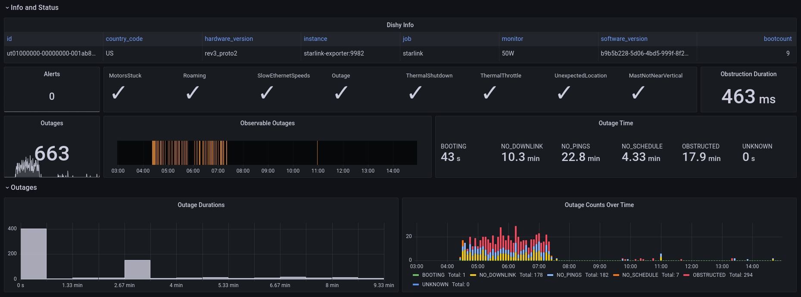
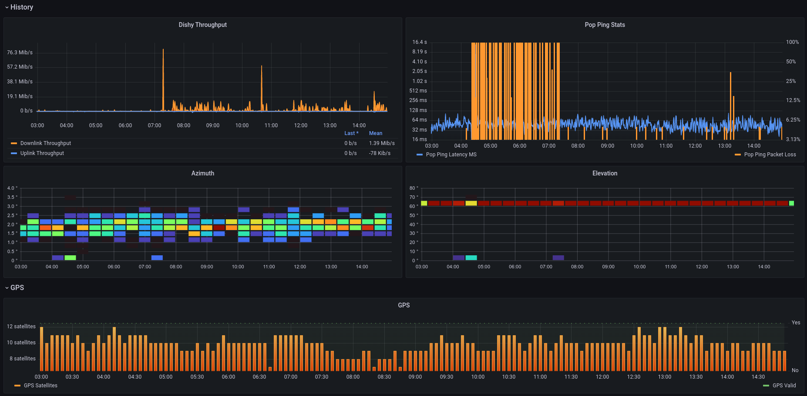
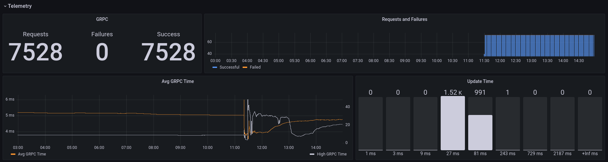

# starlink-exporter

Prometheus exporter for square dishy. There is at least one other starlink exporter out there, but the proto spec was out of date and was missing some metrics for the new square dishy.

While I could have forked the starlink-community project, I wanted to make enough changes that I just compiled a new version of Dishy's GRPC protocol and build this one from scratch.

## Grafana

A dashboard is provided for use with this exporter.

## Docker

This would probably run alongisde Prometheus in k8s or as part of a docker-compose, this container has no special requirements for permissions, volumes, etc.. configuration is done through command flags
